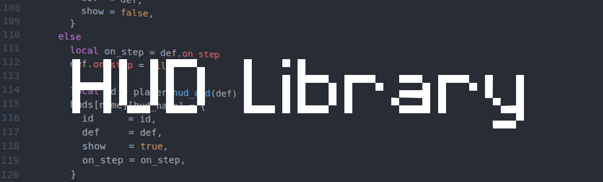

HUD Library [hudlib]
====================

This mod aims to create a better player HUD at the same time providing an extensive yet simplified API for modders (see API.md). Though this mod is small at the time, it can be expected to grow with new features including (but not limited to) hunger and armor statbars.

### Features
- Item description and itemstring is displayed when selected in hotbar
- Displays tool information in bottom-left when selected in hotbar

### Planned
- Hunger Statbar
- Armor Statbar
- Clock to display time
- API to allow easy registration of features that can be changed per-player, per-HUD with a single chatcommand
- API to register HUDs displayed to all players
- Statbar API
